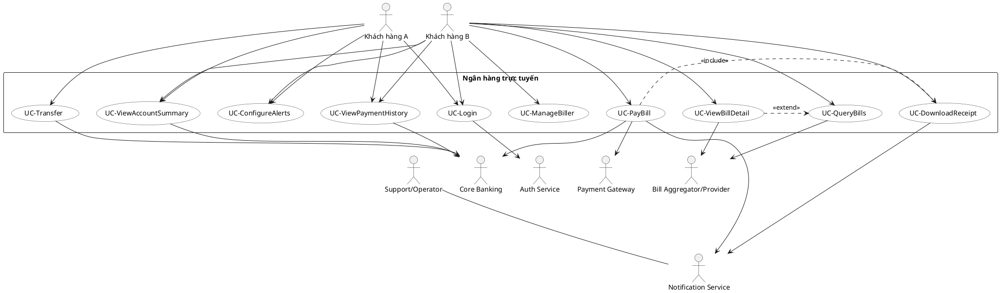
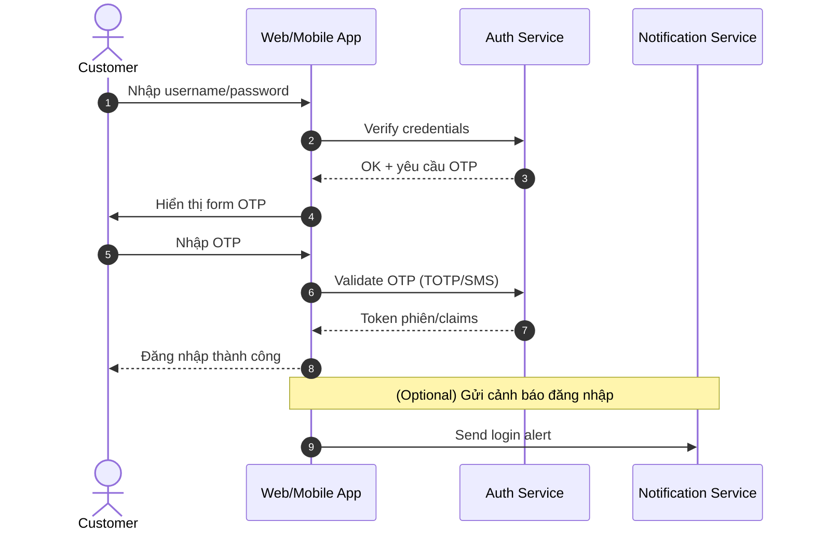
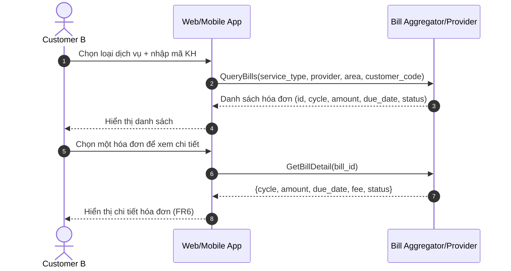
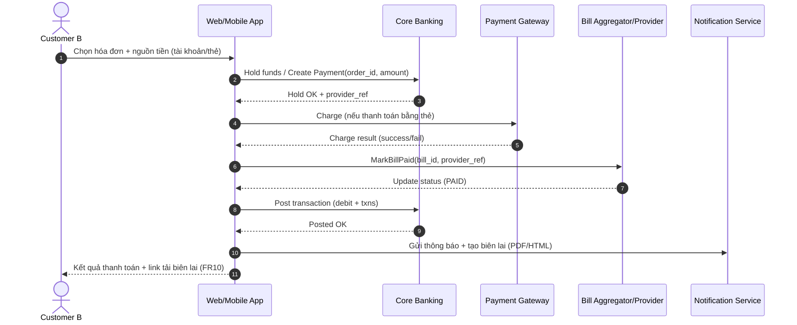
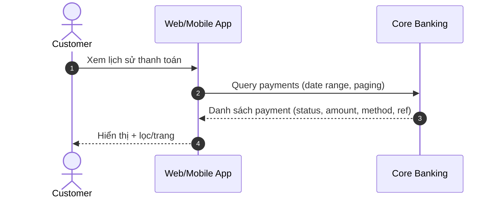
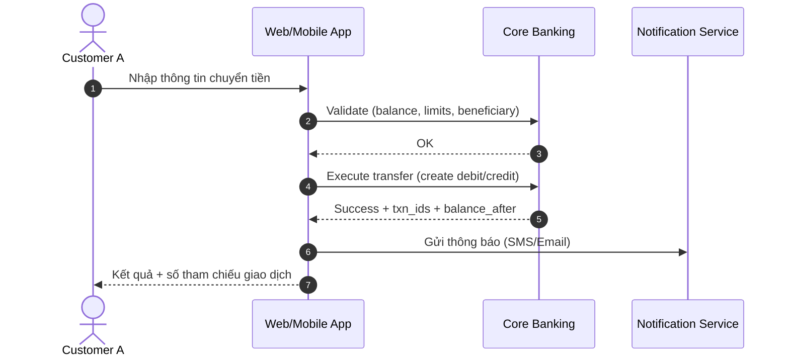
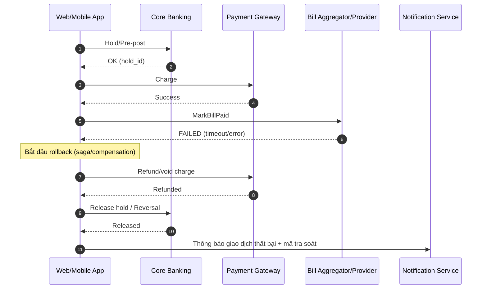
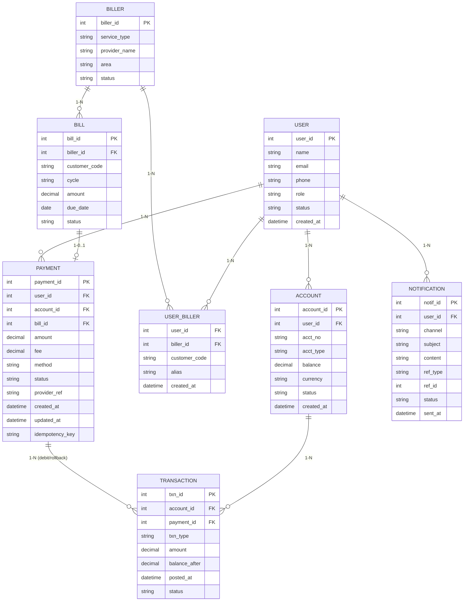

# MIDTERM 2 — Online Banking (NMCNPM)

## 1) Bối cảnh & Phạm vi

Hệ thống ngân hàng trực tuyến phục vụ hai loại người dùng cuối:

- **Người dùng A:** Tóm tắt tài khoản, **Chuyển tiền**  
- **Người dùng B:** Tóm tắt tài khoản, **Thanh toán hóa đơn** (điện/nước/Internet…)

Các dịch vụ/hệ thống tích hợp: **Auth Service**, **Core Banking**, **Bill Aggregator/Provider**, **Payment Gateway**, **Notification Service**, **Support/Operator**.

---

## 2) Actors

- Customer (Web/Mobile)
- Auth Service (đăng nhập/OTP)
- Core Banking (tài khoản, số dư, bút toán)
- Bill Aggregator / Provider (Payoo/EVN/…)
- Payment Gateway (thẻ nội địa/quốc tế)
- Notification Service (Email/SMS)
- Support/Operator (tra soát)

---

## 3) Functional Requirements (FR)

- **FR1**: Đăng nhập/đăng xuất an toàn (username + password + 2FA/OTP)  
- **FR2**: Xem tóm tắt tài khoản (số dư, 5–20 giao dịch gần nhất)  
- **FR3**: Chuyển tiền nội bộ/liên ngân hàng (áp dụng cho người dùng A)  
- **FR4**: Quản lý biller (đăng ký/sửa/xóa) — *optional cho B*  
- **FR5**: Tra cứu hóa đơn (theo loại dịch vụ/nhà cung cấp/khu vực/mã KH)  
- **FR6**: Xem chi tiết hóa đơn (kỳ, số tiền, hạn, phí)  
- **FR7**: Thanh toán hóa đơn (tài khoản/thẻ); tạo giao dịch & chứng từ  
- **FR8**: Xem lịch sử thanh toán & trạng thái (Success / Processing / Failed)  
- **FR9**: Cấu hình cảnh báo (SMS/Email) khi có hóa đơn mới/thanh toán  
- **FR10**: Tải biên lai điện tử (PDF/HTML) có mã tra soát

---

## 4) Use Case Diagram (Mermaid)

---

## 5) Sequence Diagrams

### 5.1 Login (FR1)

---

### 5.2 Query Bill (FR5 → FR6)

---

### 5.3 Pay Bill (FR7 + biên lai FR10 + thông báo FR9)

---

### 5.4 View Payment History (FR8)

---

### 5.5 Transfer Money (FR3 — Người dùng A)

---

### 5.6 Error Rollback (thất bại một bước trong Pay Bill/Transfer)

---

## 6) ER Diagram (ERD)

---

## 7) Ma trận Traceability (FR ↔ Use Case)

| FR  | Use Case                        |
|-----|---------------------------------|
| FR1 | UC-Login                        |
| FR2 | UC-ViewAccountSummary           |
| FR3 | UC-Transfer (User A)            |
| FR4 | UC-ManageBiller                 |
| FR5 | UC-QueryBills                   |
| FR6 | UC-ViewBillDetail               |
| FR7 | UC-PayBill                      |
| FR8 | UC-ViewPaymentHistory           |
| FR9 | UC-ConfigureAlerts              |
| FR10| UC-DownloadReceipt              |

---

## 8) Ghi chú triển khai & nộp

- Biểu đồ dùng **Mermaid** để GitHub render trực tiếp.  
- Use Case mô phỏng bằng `flowchart` cho tương thích GitHub.  
- Trường “idempotency_key” trong **PAYMENT** đảm bảo **an toàn khi retry** thanh toán.  
- **Error Rollback** minh họa bằng mô hình **saga/compensation** (refund/void + release hold).  
- Nộp bài: chỉ cần commit file **README.md** này vào repo GitHub.
